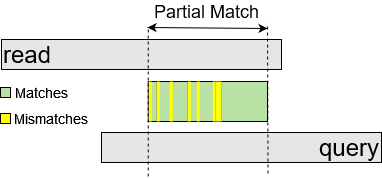

# PARMIK

This repository contains the code for **PA**rtial **R**ead **M**atching with **I**nexpensive **K**-mers (PARMIK), a fast and memory-efficient tool for identifying the  _"Partial Match"_ region between sequencing reads (e.g., aligning a 150 bp query from a newly discovered genome against a 150 bp read from a metagenomic dataset,) where the boundaries of the query and read do not necessarily align, and the overlapping region can be small, including a notable number of matches and a few mismatches (i.e., substitutions and InDels.) PARMIK indexes the metagenomic dataset to a storage-efficient Inexpensive K-mer Index (IKI), excluding highly repetitive k-mers, to keep its memory footprint small. PARMIK supports gapped and local alignment and outputs a set of alignments in SAM format. To enhance alignment speed, PARMIK supports multi-threading. 
Check out our [paper](https://www.biorxiv.org/content/10.1101/2024.10.14.618242v1) for more details.

<p align="right">
  
</p>


## Directory Structure ##
- `dataPrepare/`: Contains scripts to extract contigs from read and query dataset files
- `scripts/`: Contains scripts to evaluate experiment results
- `sraDownload/`: Contains scripts to download SRA files
- `src/`: Contains source code for the project


## Prerequisites ##
Before you begin, ensure you have the following installed on your system, (section):
- Ubuntu: All testing has been done on Ubuntu 22.04+ Operating System.
- GCC: The GNU Compiler Collection, specifically g++9 which supports C++11 or later.
- Make: The build utility to automate the compilation.
- OpenMP: Support for parallel programming in C++.
- Python3 for running the scripts

## How to Compile ##
To compile, use:
```bash
make
```
To clean up all compiled files:
```bash
make clean
```
## Download Datasets ##
To download datasets, we used _SRA Toolkit (v3.0.7)_. Here is the command we used to download a metagenomic dataset (SRR12432009):
```bash
sratoolkit.3.0.7-ubuntu64/bin/fasterq-dump SRR12432009 -p --fasta --outdir <outputDir>
 ```
Replace `<outputDir>` with the path to your desired output directory.

## How to run PARMIK ##
Here are some examples for how to use different PARMIK modes:

### Create Index ###
To execute PARMIK in the indexing mode, you can execute a command like the following, replacing `<>` with your specific paths and values:

```bash
./parmik -a 0 -c <contig_size> -t <inexpensive_k-mer_threshold> -k <k-mer_size> -i <read_count> -x -r <metagenomic_read_database_address> -f <k-mer_index_address>
```

### Alignment ###
To execute PARMIK in the alignment mode, you can execute a command like the following, replacing `<>` with your specific paths and values:

```bash
./parmik -a 1 -s <region_size> -c <contig_size> -m <min_exact_match_size> -t <inexpensive_k-mer_threshold> -k <k-mer_size> -d <percentage_identity> -i <read_count> -j <query_count> -x -r <metagenomic_read_database_address> -q <query_file_address> -f <k-mer_index_address> -o <output_directory> -p <penalty_file_address>
```
### Compare ###
To execute PARMIK in the compare mode, you can execute a command like the following, replacing `<>` with your specific paths and values:

```bash
./parmik -a 2 -l <other_tool_name> -s <region_size> -c <contig_size> -m <min_exact_match_size> -t <inexpensive_k-mer_threshold> -k <k-mer_size> -d <percentage_identity> -i <read_count> -j <query_count> -x -r <metagenomic_read_database_address> -q <query_file_address> -f <k-mer_index_address> -o <output_directory> -b <other_tool_alignment_file_address> -p <penalty_file_address>
```
### Baseline ###
To execute PARMIK in the baseline mode, you can execute a command like the following, replacing `<>` with your specific paths and values:

```bash
./parmik -a 3 -s <region_size> -c <contig_size> -t <inexpensive_k-mer_threshold> -k <k-mer_size> -d <percentage_identity> -i <read_count> -j <query_count> -r <metagenomic_read_database_address> -q <query_file_address> -o <output_directory> -p <penalty_file_address>
```
### Compare Baseline ###
To execute PARMIK in the compare baseline mode, you can execute a command like the following, replacing `<>` with your specific paths and values:

```bash
./parmik -a 4 -l <other_tool_name> -s <region_size> -c <contig_size> -m <min_exact_match_size> -t <inexpensive_k-mer_threshold> -k <k-mer_size> -d <percentage_identity> -i <read_count> -j <query_count> -x -r <metagenomic_read_database_address> -q <query_file_address> -f <k-mer_index_address> -o <output_directory> -b <other_tool_alignment_file_address> -p <penalty_file_address>
```

## PARMIK parameters:
Below are the PARMIK's parameters in alphabetical order:
- `-a`, `--mode`: PARMIK mode (*required*)
  - PARMIK operation mode. It can get these values:
    - `PARMIK_MODE_INDEX (0)`
    - `PARMIK_MODE_ALIGN (1)`
    - `PARMIK_MODE_COMPARE (2)`
    - `PARMIK_MODE_BASELINE (3)`
    - `PARMIK_MODE_CMP_BASELINE (4)`
- `-b`, `--toolFileAddress`: Other Tool Alignment File Address (*required for compare mode*)
  - The address of the output of the other tool (BLAST, BWA, etc)
- `-c`, `--contigSize`: Contig Size (*default = 150*)
  - Length of the contigs 
- `-d`, `--percentageIdentity`: Percentage Identity (*default = 90%*)
  - Minimum Percentage of Identity in the alignment
- `-e`, `--editDistance`: Max Edit Distance (i/d/s) (*default = 2*)
  - Maximum edit distance (including Substitutions and InDels) allowed in the alignment
- `-f`, `--ikiAddress`: Inexpensive K-mer Index Address (*required*)
  - The path to the Inexpensive K-mer Index (IKI)
- `-h`, `--help`: Help
- `-i`, `--readCount`: Number of Metagenomic Reads (*default = 1*)
  - Number of reads in the Metagenomic dataset 
- `-j`, `--queryCount`: Number of Queries (*default = 1*)
  - Number of queries in the Query dataset
- `-k`, `--kmerLen`: K-mer Length (*default = 16*)
  - Length of the K-mer
- `-l`, `--otherTool`: The Other Tool Name (*required for compare mode*)
  - Name of other tool (bwa, blast, etc)
- `-m`, `--minExactMatchLen`: Minimum Exact Match Length (*default = 0*)
  - Min length of exact match required for alignment
  - M = (minExactMatchLen - K + 1)
- `-n`, `--kmerRangesFileAddress`: K-mer Ranges File Address
  - K-mer ranges file address required for calculating the inexpensive k-mer threshold
- `-o`, `--outputDir`: Output Directory (*required for all modes except index mode*)
  - Directory to dump the alignment results
- `-p`, `--penaltyFileAddress`: Penalty File Address
  - The penalty score sets used for the alignment step
- `-q`, `--query`: Query File Address (*required*)
  - Path to the query dataset file
- `-r`, `--read`: Metageomic Read Data Base Address (*required*)
  - Path to the read metagenomic dataset file
- `-s`, `--regionSize`: Region Size (*default = 48*)
  - Minimum size of the alignment
- `-t`, `--cheapKmerThreshold`: Cheap (Inexpensive) k-mer Threshold (*required*)
  - -t 0: includes all k-mers in the IKI (Inexpensive K-mer Index).
- `-u`, `--isSecondChanceOff`: Turn Second Chance Off
  - Turn off the second chance
  - This is a flag. When included, it disables the second chance mechanism (sets the flag to true).
- `-v`, `--verboseLog`: Verbose Logging (*default = false*)
- `-w`, `--numThreads`: Number of Threads (*default = 1*)
- `-x`, `--isIndexOffline`: Is the read index offline
  - This is a flag. When included, it enables the write/read the IKI to/from storage.
  - If not included, PARMIK creates and use the IKI on the fly
- `-z`, `--baselineBaseAddress`: BaseLine file base address  (*required for compare mode*)
  - Base address of the baseline alignment outputs

### Help ###
To display help for general usage:
```bash
./parmik --help
```
### Citation ###

```bash
@article {Baradaran2024.10.14.618242,
	author = {Baradaran, Morteza and Layer, Ryan M and Skadron, Kevin},
	title = {PARMIK: PArtial Read Matching with Inexpensive K-mers},
	elocation-id = {2024.10.14.618242},
	year = {2024},
	doi = {10.1101/2024.10.14.618242},
	publisher = {Cold Spring Harbor Laboratory},
	abstract = {Environmental metagenomic sampling is instrumental in preparing for future pandemics by enabling early identification of potential pathogens and timely intervention strategies. Novel pathogens are a major concern, especially for zoonotic events. However, discovering novel pathogens often requires genome assembly, which remains a significant bottleneck. A robust metagenomic sampling that is directly searchable with new infection samples would give us a real-time understanding of outbreak origins dynamics. In this study, we propose PArtial Read Matching with Inexpensive K-mers (PARMIK), which is a search tool for efficiently identifying similar sequences from a patient sample (query) to a metagenomic sample (read). For example, at 90\% identity between a query and a read, PARMIK surpassed BLAST, providing up to 21\% higher recall. By filtering highly frequent k-mers, we reduced PARMIK{\textquoteright}s index size by over 50\%. Moreover, PARMIK identified longer alignments faster than BLAST, peaking at 1.57x, when parallelizing across 32 cores.Competing Interest StatementThe authors have declared no competing interest.},
	URL = {https://www.biorxiv.org/content/early/2024/10/17/2024.10.14.618242},
	eprint = {https://www.biorxiv.org/content/early/2024/10/17/2024.10.14.618242.full.pdf},
	journal = {bioRxiv}
}
```


